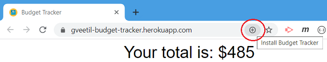
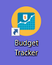

# Budget Tracker

## Description 

 
 

The budget tracker application lets you keep track of your income and expenditure, with or without a data/internet connection. It also displays a chart with your cumulative / running account balance.

This application is built as a progressive web application(PWA), and has the ability to work offline. Users can enter expenses and deposits to their budget when offline, and this data is then updated into the database when the application is back online.  

*This application is deployed on Heroku at the below link:*

[Budget Tracker - https://gveetil-budget-tracker.herokuapp.com/](https://gveetil-budget-tracker.herokuapp.com/)
 
 

## Table of Contents 

- [Technical Features](#technical-features)
 - [Heroku Deployment](#heroku-deployment)
 - [PWA](#pwa)
 - [Indexed Database](#indexed-database)
 - [Bundling and Minification](#bundling-and-minification)
- [Usage Guidelines](#usage-guidelines)

 

## Technical Features
This application is powered by Node.js, uses an express backend server and is currently hosted on Heroku. It uses mongo as the database, and mongoose as the ORM to access this database.  

### Heroku Deployment
The budget tracker application is currently deployed on Heroku and uses mLab to host the backend mongo database. 

### PWA 
The budget tracker is a progressive web application(PWA), and utilizes the Service Worker and Cache APIs to cache assets and API responses to ensure the application works without an internet connection.

### Indexed Database 
This application uses the Indexed Database to store data in the user's browser when in offline mode. The Indexed DB is used as a temporary data store, and is cleared once the data is synchronized with the master database.

### Bundling and Minification
The budget tracker uses Webpack to bundle and minify javascript files and Babel to transpile the JavaScript code so that it is compatible with older browsers or environments. 

## Usage Guidelines

When the budget tracker application is opened, it loads up the current data in the system and displays the below page:  

   

* Here users can view the transactions in the system and the corresponding amounts.
* The total displays the current account balance.
* The Chart displays the cumulative / running account balance for each transaction. 
* To add a new income, enter the transaction name and amount and click the Add Funds button.
* To add an expense, enter the transaction name and amount and click the Subtract Funds button.
* Once a transaction is entered, it is displayed in the table and the chart and total values are updated to show the latest transaction.
* If the data entered is incorrect, a validation message is displayed as below:  

   

* The application can be installed as a PWA by clicking on the install button in the address bar:    

   

* This will install the application and it can be accessed from the home screen / desktop by clicking:    

   

